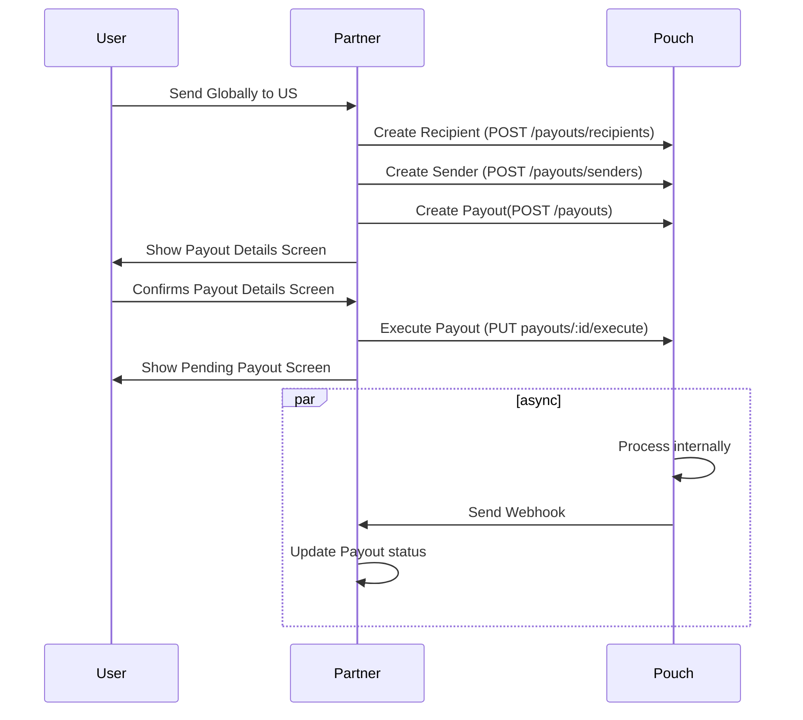
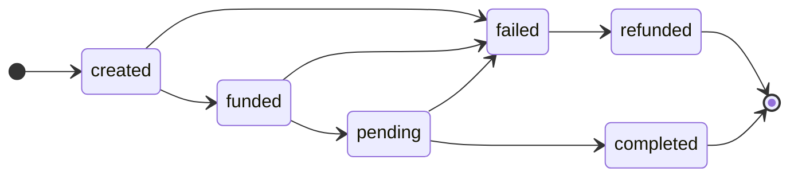

# Pouch Payout API

### Table of Contents
- [Partner Integration Flow](#partner-integration-flow)
- [Authentication](#authentication)
- [Endpoints](#endpoints)
    - [Recipients](#recipients)
    - [Senders](#senders)
    - [Payouts](#payouts)
    - [Webhooks](#webhooks)
    - [Countries](#countries)
- [Test Data](#test-data)
- [Errors](#errors)

## Partner Integration Flow

This shows the sequential calls to the Pouch Payout API from a Partner's perspective.



## Authentication
All endpoints requires an `X-Pouch-Api-Key` header. An additional signature header `X-Pouch-Signature` is required for some endpoints, it is generated using HMAC-SHA256, a secret and the request body in JSON-string form.

To generate the signature:
```js
// nodejs
const crypto = require('crypto')

const sign = (body, secret) => {
  const hmac = crypto.createHmac('sha256', secret)
  return hmac.update(JSON.stringify(body)).digest('hex')
}
// hash: 888bb3c0b398422bcda0f612857f7da7fa5c70ca390c0b20c7853214dc06866
```

## Endpoints

Recipients
|Method|Path|Description|-
|-|-|-|-|
|`POST`|`/payouts/recipients`|create a recipient|[navigate](#create-recipient)
|`GET`|`/payouts/recipients`|retrieve all recipients|[navigate](#get-recipients)
|`GET`|`/payouts/recipients/:id`|retrieve a recipient by id|[navigate](#get-recipient)
|`DELETE`|`/payouts/recipients/:id`|delete a recipient by id|[navigate](#delete-recipient)

Senders
|Method|Path|Description|-
|-|-|-|-|
|`POST`|`/payouts/senders`|create a sender|[navigate](#create-sender)
|`GET`|`/payouts/senders`|retrieve all senders|[navigate](#get-senders)
|`GET`|`/payouts/senders/:id`|get a sender by id|[navigate](#get-sender)
|`DELETE`|`/payouts/senders/:id`|delete a sender by id|[navigate](#delete-sender)

Payouts
|Method|Path|Description|-
|-|-|-|-|
|`POST`|`/payouts`|create a payout|[navigate](#create-payout)
|`PUT`|`/payouts/:referenceId/execute`|execute a payout|[navigate](#execute-payout)
|`GET`|`/payouts/:referenceId/refresh`|refresh a payout|[navigate](#refresh-payout)
|`GET`|`/payouts/:id`|get a payout by id|[navigate](#get-payout)

Webhooks
|Method|Path|Description|-
|-|-|-|-|
|`PUT`|`/webhooks`|upsert a webhook|[navigate](#upsert-webhook)
|`GET`|`/webhooks`|get all webhooks|[navigate](#get-webhooks)
|`DELETE`|`/webhooks/:id`|delete a webhook by id|[navigate](#delete-webhook)

Countries
|Method|Path|Description|-
|-|-|-|-|
|`GET`|`/countries`|get country details|[navigate](#countries)

### Recipients
A resource that contains details of the receiving person their bank information
- The recipient id returned is required to create a payout ([see here](#create-payout))
- There's a `$20` fee for `US_DOMESTIC_WIRE` and `$0` fee for `ACH`
- Ideally, the recipient id should be saved and be used for recurring payouts
- Add additional recipient entries for `recipients` in case of joint accounts

#### Create Recipient
```
POST /payouts/recipients
```

Headers
```
X-Pouch-Api-Key: api-key
X-Pouch-Signature: signature
Content-Type: application/json
```
Request
```js
{
  "country": "US",
  "transferType": "ACH",
  "accountType": "CHECKING",
  "accountNumber": "111111111111",
  "routingNumber": "222222222",
  "recipients": [
    {
      "name": "John Doe",
      "type": "INDIVIDUAL",
      "address": {
        "line1": "Line1 Address",
        "country": "US",
        "state": "WA",
        "city": "Richland",
        "postCode": "99354"
      }
    }
  ]
}
```
|Property|Type|Format|Min-Max|Required|Conditions|
|-|-|-|-|-|-|
|`country`|`string`|`US`|`-`|`Y`|`-`
|`transferType`|`string`|`ACH`, `US_DOMESTIC_WIRE`|`-`|`Y`|`-`
|`accountType`|`string`|`SAVINGS`, `CHECKING`|`-`|`Conditional`|Required if `transferType` is `ACH`
|`accountNumber`|`string`|`integer`|`5-17 char`|`Y`|`-`
|`routingNumber`|`string`|`integer`|`9-9 char`|`Y`|`-`
|`recipients`|`array`|`recipient`|`1-2 recipient`|`Y`|`-`
|`recipients..name`|`string`|`string`|`1-64 char`|`Y`|`-`
|`recipients..type`|`string`|`INDIVIDUAL`, `COMPANY`|`-`|`Y`|`-`
|`recipients..address`|`object`|`address`|`-`|`Conditional`|Required if `transferType` is `US_DOMESTIC_WIRE`
|`recipients..address.line1`|`string`|`string`|`1-64 char`|`Y`|`-`
|`recipients..address.country`|`string`|[`see countries`](#countries)|`-`|`Y`|`-`
|`recipients..address.state`|`string`|[`see countries`](#countries)|`-`|`Y`|`-`
|`recipients..address.city`|`string`|[`see countries`](#countries)|`1-64 char`|`Y`|`-`
|`recipients..address.postCode`|`string`|`string`|`1-12 char`|`Y`|`-`

Response
```js
// 201 CREATED
{
  "data": {
    "id": "c0a4153c-40fd-4f58-8863-98289775e799",
    "country": "US",
    "transferType": "ACH",
    "accountNumber": "111111111111",
    "accountType": "CHECKING",
    "routingNumber": "222222222",
    "recipients": [
      {
        "name": "John Doe",
        "type": "INDIVIDUAL",
        "address": {
          "line1": "Line1 Address",
          "country": "US",
          "state": "WA",
          "city": "Richland",
          "postCode": "99354"
        }
      }
    ],
    "createdAt": "2023-06-02T06:19:15.709Z",
    "updatedAt": "2023-06-02T06:19:15.709Z"
  }
}
```
___
#### Get Recipient
```
GET /payouts/recipients/:id
```

Headers
```
X-Pouch-Api-Key: api-key
```
Request
```
GET /payouts/recipients/c0a4153c-40fd-4f58-8863-98289775e799
```
Response
```js
// 200 OK
{
  "data": {
    "id": "c0a4153c-40fd-4f58-8863-98289775e799",
    "country": "US",
    "transferType": "ACH",
    "accountNumber": "111111111111",
    "accountType": "CHECKING",
    "routingNumber": "222222222",
    "recipients": [
      {
        "name": "John Doe",
        "type": "INDIVIDUAL",
        "address": {
          "line1": "Line1 Address",
          "country": "US",
          "state": "WA",
          "city": "Richland",
          "postCode": "99354"
        }
      }
    ],
    "createdAt": "2023-06-02T06:19:15.709Z",
    "updatedAt": "2023-06-02T06:19:15.709Z"
  }
}
```
___
#### Delete Recipient
```
DEL /payouts/recipients/:id
```

Headers
```
X-Pouch-Api-Key: api-key
```
Request
```
DEL /payouts/recipients/c0a4153c-40fd-4f58-8863-98289775e799
```
Response
```js
// 204 NO_CONTENT
```
___
#### Get Recipients 
```
GET /payouts/recipients
```

Headers
```
X-Pouch-Api-Key: api-key
```

Request
```js
GET /payouts/recipients
```

Response
```js
// 200 OK
{
  "data": [
    {
      "id": "c0a4153c-40fd-4f58-8863-98289775e799",
      "country": "US",
      "transferType": "ACH",
      "accountNumber": "111111111111",
      "accountType": "CHECKING",
      "routingNumber": "222222222",
      "recipients": [
        {
          "name": "John Doe",
          "type": "INDIVIDUAL",
          "address": {
            "line1": "Line1 Address",
            "country": "US",
            "state": "WA",
            "city": "Richland",
            "postCode": "99354"
          }
        }
      ],
      "createdAt": "2023-06-02T06:19:15.709Z",
      "updatedAt": "2023-06-02T06:19:15.709Z"
    }
  ]
}
```

### Senders
A resource that contains sender details
- The sender id returned is required to create a payout ([see here](#create-payout))
- The sender id should be saved and be used for recurring payouts
- Sender information should be the users from the Partner not the Partner itself

#### Create Sender
```
POST /payouts/senders
```

Headers
```
X-Pouch-Api-Key: api-key
X-Pouch-Signature: signature
Content-Type: application/json
```
Request
```
{
  "country": "US",
  "type": "INDIVIDUAL",
  "name": "Jerry Smith",
  "address": {
    "line1": "Line1 Address",
    "country": "PH",
    "state": "NCR",
    "city": "Makati",
    "postCode": "1200"
  }
}
```
|Property|Type|Format|Min-Max|Required|Condition|
|-|-|-|-|-|-|
|`country`|`string`|`US`|`-`|`Y`
|`type`|`string`|`INDIVIDUAL`, `COMPANY`|`-`|`Y`
|`name`|`string`|`string`|`1-64 char`|`Y`
|`address`|`object`|`object`|`-`|`Y`
|`address.line1`|`string`|`string`|`1-64 char`|`Y`
|`address.country`|`string`|[`see countries`](#countries)|`-`|`Y`
|`address.state`|`string`|[`see countries`](#countries)|`-`|`Y`
|`address.city`|`string`|[`see countries`](#countries)|`1-64 char`|`Y`
|`address.postCode`|`string`|`string`|`1-12 char`|`Y`

Response
```js
// 201 CREATED
{
  "data": {
    "id": "e39c9d7a-fd89-429b-ade7-4825ce9c9e25",
    "name": "Jerry Smith",
    "country": "US",
    "type": "INDIVIDUAL",
    "address": {
      "country": "PH",
      "state": "NCR",
      "city": "Makati",
      "line1": "Line1 Address",
      "postCode": "1200"
    },
    "createdAt": "2023-06-02T06:36:35.864Z",
    "updatedAt": "2023-06-02T06:36:35.864Z"
  }
}
```
___
#### Get Sender
```
GET /payouts/senders/:id
```

Header
```
X-Pouch-Api-Key: api-key
```
Request
```
GET /payouts/senders/:id
```
Response
```js
// 200 OK
{
  "data": {
    "id": "e39c9d7a-fd89-429b-ade7-4825ce9c9e25",
    "name": "Jerry Smith",
    "country": "US",
    "type": "INDIVIDUAL",
    "address": {
      "country": "PH",
      "state": "NCR",
      "city": "Makati",
      "line1": "Line1 Address",
      "postCode": "1200"
    },
    "createdAt": "2023-06-02T06:36:35.864Z",
    "updatedAt": "2023-06-02T06:36:35.864Z"
  }
}
```
___
#### Delete Sender
```
DEL /payouts/senders/:id
```

Header
```
X-Pouch-Api-Key: api-key
```
Request
```
DEL /payouts/senders/e39c9d7a-fd89-429b-ade7-4825ce9c9e25
```

Response
```js
// 204 NO_CONTENT
```
___
#### Get Senders
```
GET /payouts/senders
```

Header
```
X-Pouch-Api-Key: api-key
```
Request
```
GET /payouts/senders
```
Response
```js
// 200 OK
{
  "data": [
    {
      "id": "e39c9d7a-fd89-429b-ade7-4825ce9c9e25",
      "name": "Jerry Smith",
      "country": "US",
      "type": "INDIVIDUAL",
      "address": {
        "country": "PH",
        "state": "NCR",
        "city": "Makati",
        "line1": "Line1 Address",
        "postCode": "1200"
      },
      "createdAt": "2023-06-02T06:36:35.864Z",
      "updatedAt": "2023-06-02T06:36:35.864Z"
    }
  ]
}
```

### Payouts
The resource that you use to initiate a payout to a target recipient

|Type|Description
|-|-|
|created|initial state, waiting for payout to be executed
|funded|payout is executed, waiting for payout to be processed
|pending|payout is processing, waiting for payout to be completed or failed
|failed|payout failed and will be refunded
|refunded|payout refunded
|completed|payout success
#### Create Payout
- Partner-provided `referenceId` will be used as the main identifier for a payout
- The payout expires within 1 min. [#refresh-payout](Refresh) the payout to get a re-quote
```
POST /payouts
```

Headers
```
X-Pouch-Api-Key: api-key
X-Pouch-Signature: signature
Content-Type: application/json
```
Request
```js
{
  "referenceId": "a939dc00-e802-4756-9715-71853c17d155",
  "description": "Payout of USD 100.00",
  "recipientId": "c0a4153c-40fd-4f58-8863-98289775e799",
  "senderId": "e39c9d7a-fd89-429b-ade7-4825ce9c9e25",
  "currency": "USD",
  "amount": "100"
}
```
|Property|Type|Format|Min-Max|Required|Conditions
|-|-|-|-|-|-|
|`referenceId`|`string`|`uuid`|`-`|`Y`
|`description`|`string`|`string`|`1-150 char`|`N`
|`recipientId`|`string`|`uuid`|`-`|`Y`
|`senderId`|`string`|`uuid`|`-`|`Y`
|`currency`|`string`|`USD`|`-`|`Y`
|`amount`|`string`|`float`|`1`/`100`-`1000` `USD`|`Y`|min of `1` for `ACH` and min of `100` for `US_DOMESTIC_WIRE`

Response
```js
// 201 CREATED
{
  "data": {
    "id": "74b672ee-aa97-4eb4-adc1-70d0a3227f35",
    "referenceId": "a939dc00-e802-4756-9715-71853c17d155",
    "status": "created",
    "description": "Payout of USD 100.00",
    "amount": "100",
    "fee": "0",
    "currency": "USD",
    "convertedAmount": "5768.76294",
    "convertedFee": "0",
    "convertedCurrency": "PHP",
    "sender": {
      "address": {
        "country": "PH",
        "state": "NCR",
        "city": "Makati",
        "line1": "Line1 Address",
        "postCode": "1200"
      },
      "id": "e39c9d7a-fd89-429b-ade7-4825ce9c9e25",
      "type": "INDIVIDUAL",
      "name": "Jerry Smith"
    },
    "recipient": {
      "recipients": [
        {
          "address": {
            "line1": "Line1 Address",
            "country": "US",
            "state": "WA",
            "city": "Richland",
            "postCode": "99354"
          },
          "name": "John Doe",
          "type": "INDIVIDUAL"
        }
      ],
      "id": "c0a4153c-40fd-4f58-8863-98289775e799",
      "transferType": "ACH",
      "routingNumber": "222222222",
      "accountType": "CHECKING",
      "accountNumber": "111111111111"
    },
    "createdAt": "2023-06-02T07:26:01.672Z",
    "updatedAt": "2023-06-02T07:26:01.672Z"
  }
}
```
___
#### Execute Payout
```
PUT /payouts/:referenceId/execute
```

Headers
```
X-Pouch-Api-Key: api-key
```
Request
```js
PUT /payouts/74b672ee-aa97-4eb4-adc1-70d0a3227f35/execute
```

Response
```js
// 200 OK
{
  "data": {
    "id": "74b672ee-aa97-4eb4-adc1-70d0a3227f35",
    "referenceId": "a939dc00-e802-4756-9715-71853c17d155",
    "status": "funded",
    "description": "Payout of USD 100.00",
    "amount": "100",
    "fee": "0",
    "currency": "USD",
    "convertedAmount": "5768.76294",
    "convertedFee": "0",
    "convertedCurrency": "PHP",
    "sender": {
      "address": {
        "country": "PH",
        "state": "NCR",
        "city": "Makati",
        "line1": "Line1 Address",
        "postCode": "1200"
      },
      "id": "e39c9d7a-fd89-429b-ade7-4825ce9c9e25",
      "type": "INDIVIDUAL",
      "name": "Jerry Smith"
    },
    "recipient": {
      "recipients": [
        {
          "address": {
            "line1": "Line1 Address",
            "country": "US",
            "state": "WA",
            "city": "Richland",
            "postCode": "99354"
          },
          "name": "John Doe",
          "type": "INDIVIDUAL"
        }
      ],
      "id": "c0a4153c-40fd-4f58-8863-98289775e799",
      "transferType": "ACH",
      "routingNumber": "222222222",
      "accountType": "CHECKING",
      "accountNumber": "111111111111"
    },
    "createdAt": "2023-06-02T07:26:01.672Z",
    "updatedAt": "2023-06-02T07:42:37.175Z"
  }
}
```
___
#### Get Payout
```
GET /payouts/:referenceId
```

Headers
```
X-Pouch-Api-Key: api-key
```
Request
```
GET /payouts/a939dc00-e802-4756-9715-71853c17d155
```
Response
```js
// 200 OK
{
  "data": {
    "id": "74b672ee-aa97-4eb4-adc1-70d0a3227f35",
    "referenceId": "a939dc00-e802-4756-9715-71853c17d155",
    "status": "completed",
    "description": "Payout of USD 100.00",
    "amount": "100",
    "fee": "0",
    "currency": "USD",
    "convertedAmount": "5768.76294",
    "convertedFee": "0",
    "convertedCurrency": "PHP",
    "sender": {
      "address": {
        "country": "PH",
        "state": "NCR",
        "city": "Makati",
        "line1": "Line1 Address",
        "postCode": "1200"
      },
      "id": "e39c9d7a-fd89-429b-ade7-4825ce9c9e25",
      "type": "INDIVIDUAL",
      "name": "Jerry Smith"
    },
    "recipient": {
      "recipients": [
        {
          "address": {
            "line1": "Line1 Address",
            "country": "US",
            "state": "WA",
            "city": "Richland",
            "postCode": "99354"
          },
          "name": "John Doe",
          "type": "INDIVIDUAL"
        }
      ],
      "id": "c0a4153c-40fd-4f58-8863-98289775e799",
      "transferType": "ACH",
      "routingNumber": "222222222",
      "accountType": "CHECKING",
      "accountNumber": "111111111111"
    },
    "createdAt": "2023-06-02T07:26:01.672Z",
    "updatedAt": "2023-06-02T07:46:00.723Z"
  }
}
```
___
#### Refresh Payout
```
GET /payouts/:referenceId/refresh
```

Headers
```
X-Pouch-Api-Key: api-key
```
Request
```
GET /payouts/a939dc00-e802-4756-9715-71853c17d155/refresh
```
Response
```js
// 200 OK
{
  "data": {
    "id": "74b672ee-aa97-4eb4-adc1-70d0a3227f35",
    "referenceId": "a939dc00-e802-4756-9715-71853c17d155",
    "status": "created",
    "description": "Payout of USD 100.00",
    "amount": "100",
    "fee": "0",
    "currency": "USD",
    "convertedAmount": "5766.3493",
    "convertedFee": "0",
    "convertedCurrency": "PHP",
    "sender": {
      "address": {
        "country": "PH",
        "state": "NCR",
        "city": "Makati",
        "line1": "Line1 Address",
        "postCode": "1200"
      },
      "id": "e39c9d7a-fd89-429b-ade7-4825ce9c9e25",
      "type": "INDIVIDUAL",
      "name": "Jerry Smith"
    },
    "recipient": {
      "recipients": [
        {
          "address": {
            "line1": "Line1 Address",
            "country": "US",
            "state": "WA",
            "city": "Richland",
            "postCode": "99354"
          },
          "name": "John Doe",
          "type": "INDIVIDUAL"
        }
      ],
      "id": "c0a4153c-40fd-4f58-8863-98289775e799",
      "transferType": "ACH",
      "routingNumber": "222222222",
      "accountType": "CHECKING",
      "accountNumber": "111111111111"
    },
    "createdAt": "2023-06-02T07:26:01.672Z",
    "updatedAt": "2023-06-02T07:46:00.723Z"
  }
}
```

### Webhooks
A resource used to get you notified on certain state changes of an payout via an HTTP call to your preconfigured url.

Pouch will generate a signature using HMAC-SHA256 and assign it to the `X-Pouch-Signature` header per webhook event. A POST request will be sent to the webhook url and expecting a 2xx response from the client.

#### Events
|Type|Description
|-|-|
|`payout.completed`|triggers when the payout status transitions to `completed`|
|`payout.failed`|triggers when the payout status transitions to `failed`|

To verify the signature:
1. You need to extract the `X-Pouch-Signature` in the header upon receiving the request
2. Parse the request body to a JSON-string and compute the signature with HMAC-SHA256 and your secret key
3. Compare the generated hash against the value in `X-Pouch-Signature`

#### Event Payload

Headers
```
X-Pouch-Signature: signature
Content-Type: application/json
```
Request
```js
{
  "id": "25a3a581-f163-4652-b848-bff19b020fc8",
  "event": "payout.completed",
  "payload": {
    "id": "4d0bc068-48e4-43a8-a923-2c26a916938c",
    "referenceId": "a939dc00-e802-4756-9715-71853c17d155",
    "status": "completed",
    "description": "Payout of USD 100.00",
    "amount": "100",
    "fee": "0",
    "currency": "USD",
    "convertedAmount": "5768.76294",
    "convertedFee": "0",
    "convertedCurrency": "PHP",
    "sender": {
      "address": {
        "country": "PH",
        "state": "NCR",
        "city": "Makati",
        "line1": "Line1 Address",
        "postCode": "1200"
      },
      "id": "e39c9d7a-fd89-429b-ade7-4825ce9c9e25",
      "type": "INDIVIDUAL",
      "name": "Jerry Smith"
    },
    "recipient": {
      "recipients": [
        {
          "address": {
            "line1": "Line1 Address",
            "country": "US",
            "state": "WA",
            "city": "Richland",
            "postCode": "99354"
          },
          "name": "John Doe",
          "type": "INDIVIDUAL"
        }
      ],
      "id": "c0a4153c-40fd-4f58-8863-98289775e799",
      "transferType": "ACH",
      "routingNumber": "222222222",
      "accountType": "CHECKING",
      "accountNumber": "111111111111"
    },
    "createdAt": "2023-06-02T08:47:40.397Z",
    "updatedAt": "2023-06-02T08:47:40.397Z"
  }
}
```

#### Retry Strategy
If we received a non-2xx response, we'll re-schedule the webhook to be delivered up to 4 more times with an exponential 30 minute delay.

Example:
|Run|Timestamp
|-|-|
|0|06-02-2023 1:00:00:000 UTC
|1|06-02-2023 1:30:00:000 UTC
|2|06-02-2023 2:30:00:000 UTC
|3|06-02-2023 4:30:00:000 UTC
|4|06-02-2023 8:30:00:000 UTC

___
#### Upsert Webhook
```
PUT /payouts/webhook
```

Headers
```
X-Pouch-Api-Key: api-key
X-Pouch-Signature: signature
Content-Type: application/json
```

Request
```js
{
  "event": "payout.completed",
  "url": "https://sample.com"
}
```
Response
```js
{
  "data": {
    "id": "8f3ed396-39ee-4674-b5dc-4d7bd936988e",
    "event": "payout.completed",
    "url": "https://sample.com"
    "createdAt": "2023-06-02T08:47:34.302Z",
    "updatedAt": "2023-06-02T08:47:34.302Z"
  }
}
```
___
#### Get Webhooks
```
GET /payouts/webhook
```

Headers
```
X-Pouch-Api-Key: api-key
```
Request
```
GET /payouts/webhook
```
Response
```
{
  "data": [
    {
      "id": "8f3ed396-39ee-4674-b5dc-4d7bd936988e",
      "event": "payout.completed",
      "url": "https://sample.com"
      "createdAt": "2023-06-02T08:47:34.302Z",
      "updatedAt": "2023-06-02T08:47:34.302Z"
    }
  ]
}
```
___
#### Delete Webhook
```
DEL /payouts/webhook/:id
```

Headers
```
X-Pouch-Api-Key: api-key
```

Request
```
DEL /payouts/webhook/8f3ed396-39ee-4674-b5dc-4d7bd936988e
```

Response
```js
// 204 NO_CONTENT
```
___
### Countries
The resource used to get country information when creating a recipient and sender
- Due to limited support to the library we use, there are instances where a country returns empty states, or a state returns empty cities. In case this happens, `address.city` and `address.state` becomes free-form.

Header
```
X-Pouch-Api-Key: api-key
```

#### Get All Countries

Request
```js
GET /countries
```
Response
```js
// 200 OK
{
  "data": [
    ...
    {
      "name": "Ukraine",
      "code": "UA",
      "flag": "🇺🇦"
    },
    {
      "name": "United Arab Emirates",
      "code": "AE",
      "flag": "🇦🇪"
    },
    {
      "name": "United Kingdom",
      "code": "GB",
      "flag": "🇬🇧"
    },
    {
      "name": "United States",
      "code": "US",
      "flag": "🇺🇸"
    }
    ...
  ]
}
```
___
#### Get All States By Country

Request
```js
GET /countries?country=US
```
Response
```js
// 200 OK
{
  "data": [
    ...
    {
      "name": "Alabama",
      "code": "AL"
    },
    {
      "name": "Alaska",
      "code": "AK"
    },
    {
      "name": "American Samoa",
      "code": "AS"
    },
    {
      "name": "Arizona",
      "code": "AZ"
    },
    {
      "name": "Arkansas",
      "code": "AR"
    }
    ...
  ]
}
```
___
#### Get All Cities By State And Country

Request
```js
GET /countries?country=US&state=AZ
```
Response
```js
// 200K
{
  "data": [
    {
      "name": "Ahwatukee Foothills"
    },
    {
      "name": "Ajo"
    },
    {
      "name": "Alhambra"
    },
    {
      "name": "Anthem"
    },
    {
      "name": "Apache County"
    }
  ]
}
```

## Test Data
You can simulate successful and failed payouts using the recipient details below. Note that only the `transferType`, `accountNumber`, and `routingNumber` matters, other field values are free to change.

|Name|Transfer Type|Account Number|Routing Number|Status
|-|-|-|-|-|
|Jerry Smith|ACH|284225763596|191065917|completed
|Celia Reed|ACH|128441819660|566100508|failed
|Glenn Farmer|US_DOMESTIC_WIRE|527184311319|445172056|completed
|Randy Baker|US_DOMESTIC_WIRE|421871679318|808140248|failed

## Errors
### HTTP Codes
|HTTP Status|Title|Description
|-|-|-|
|200|OK|The request was successful|
|201|Created|The resource was sucessfully created|
|400|BadRequest|A failed request validation occurred|
|401|Unauthorized|Invalid authentication|
|403|Forbidden|Invalid permission to perform the request|
|404|NotFound|The resource does not exist|
|422|Unprocessable|Unable to process the request|
|500|InternalServerError|An internal Pouch error has occured|

### Error Messages
|HTTP Status|Code|Message|Details|
|-|-|-|-|
400|BadRequest|Validation failed for schema (.*)|Contains validation details|
401|Unauthorized|API Key is required|
401|Unauthorized|API Key is invalid|
401|Unauthorized|Signature is required|
401|Unauthorized|Signature is invalid|
403|Unauthorized|Invalid Access|
404|NotFound|Recipient not found|
404|NotFound|Sender not found|
404|NotFound|Transaction not found|
422|Unprocessable|User insufficient funds|
422|Unprocessable|Invalid transaction state|
500|InternalServerError|Failed to create recipient|
500|InternalServerError|Failed to create sender|
500|InternalServerError|Failed to create payout|
500|InternalServerError|Failed to fetch exchange rates|
500|InternalServerError|Failed to deduct user balance|
500|InternalServerError|Failed to execute payout|

### Error Response
```js
// 400 Bad Request
{
  "error": {
    "code": "BadRequest",
    "message": "Validation failed for schema createPayout",
    "details": [
      "recipientId is a required field"
    ]
  }
}
```
```js
// 401 Unauthorized
{
  "error": {
    "code": "Unauthorized",
    "message": "Invalid Signature",
    "details": []
  }
}
```
```js
// 404 NotFound
{
  "error": {
    "code": "NotFound",
    "message": "Transaction not found",
    "details": []
  }
}
```
```js
// 422 Unprocessable
{
  "error": {
    "code": "Unprocessable",
    "message": "Transaction state is invalid",
    "details": []
  }
}
```
```js
// 500 InternalServerError
{
  "error": {
    "code": "Unprocessable",
    "message": "Transaction state is invalid",
    "details": []
  }
}
```
