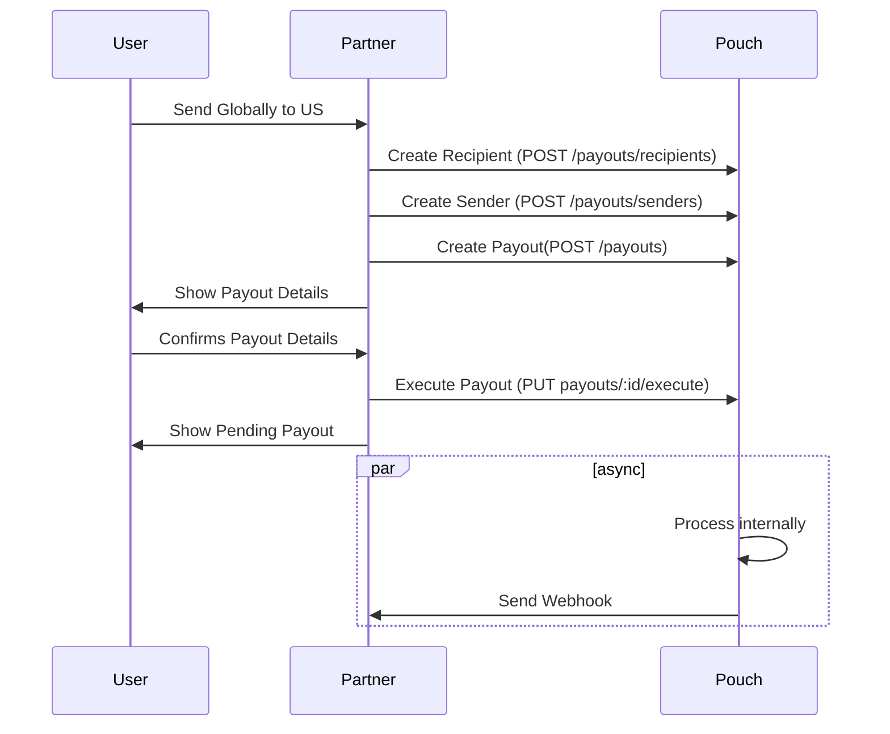
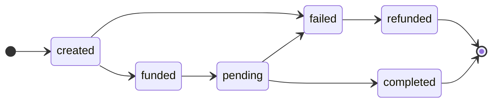

# Pouch Payout API

### Table of Contents
- [Integration Flow](#integration-flow)
- [Authentication](#authentication)
- [Recipients](#recipients)
- [Senders](#sender)
- [Payouts](#payout)
- [Webhooks](#webhooks)

## Integration Flow


## Authentication
Authentication is required to access any endpoint. You need the API Key in the `X-Pouch-Api-Key` header. There's an additional `X-Pouch-Signature` header for some endpoints. It's a signature generated using HMAC-SHA256, a secret key and the body of the request.

To generate the signature:
```js
// nodejs
const crypto = require('crypto')

const sign = (body, secret) => {
  const hmac = crypto.createHmac('sha256', secret)
  return hmac.update(JSON.stringify(body)).digest('hex')
}
// hash: 888bb3c0b398422bcda0f612857f7da7fa5c70ca390c0b20c7853214dc06866
```

## Recipients
### POST /payouts/recipients
- Creates recipient details required to create a payout

Headers
```
X-Pouch-Api-Key: apiKey
Content-Type: application/json
```
Request
```js
{
    "country": "US",
    "transferType": "US_DOMESTIC_WIRE",
    "accountNumber": "411007866690",
    "routingNumber": "031101334",
    "recipients": [
        {
            "name": "Ethan Rose",
            "type": "INDIVIDUAL",
            "address": {
                "line1": "2991 Sedona Cir",
                "country": "US",
                "state": "WA",
                "city": "Richland",
                "postCode": "99354"
            }
        }
    ]
}
```
Response
```js
{
    "data": {
        "id": "64756ba0684993e6bd99a9a1",
        "country": "US",
        "transferType": "US_DOMESTIC_WIRE",
        "accountNumber": "411007866690",
        "routingNumber": "031101334",
        "recipients": [
            {
                "name": "Ethan Rose",
                "type": "INDIVIDUAL",
                "address": {
                    "line1": "2991 Sedona Cir",
                    "country": "US",
                    "state": "WA",
                    "city": "Richland",
                    "postCode": "99354"
                }
            }
        ],
        "createdAt": "2023-05-30T03:21:04.554Z",
        "updatedAt": "2023-05-30T03:21:04.554Z"
    }
}
```
### GET /payouts/recipients/:recipientId
- Retrieves a recipient by id

Headers
```
X-Pouch-Api-Key: apiKey
Content-Type: application/json
```
Request
```js
GET /payouts/recipients/64756ba0684993e6bd99a9a1
```
Response
```js
{
    "data": {
        "id": "64756ba0684993e6bd99a9a1",
        "country": "US",
        "transferType": "US_DOMESTIC_WIRE",
        "accountNumber": "411007866690",
        "routingNumber": "031101334",
        "recipients": [
            {
                "name": "Ethan Rose",
                "type": "INDIVIDUAL",
                "address": {
                    "line1": "2991 Sedona Cir",
                    "country": "US",
                    "state": "WA",
                    "city": "Richland",
                    "postCode": "99354"
                }
            }
        ],
        "createdAt": "2023-05-30T03:21:04.554Z",
        "updatedAt": "2023-05-30T03:21:04.554Z"
    }
}
```

### DEL /payouts/recipients/:recipientId
- Deletes a recipient by id

Headers
```
X-Pouch-Api-Key: apiKey
Content-Type: application/json
```
Request
```js
DEL /payouts/recipients/64756ba0684993e6bd99a9a1
```
Response
```
// 204 NO CONTENT
```

### GET /payouts/recipients
- Lists all recipients created by the partner

Headers
```
X-Pouch-Api-Key: apiKey
Content-Type: application/json
```

Request
```js
GET /payouts/recipients
```

Response
```json
{
    "data": [
        {
            "id": "64756ba0684993e6bd99a9a1",
            "country": "US",
            "transferType": "US_DOMESTIC_WIRE",
            "accountNumber": "411007866690",
            "routingNumber": "031101334",
            "recipients": [
                {
                    "name": "Ethan Rose",
                    "type": "INDIVIDUAL",
                    "address": {
                        "line1": "2991 Sedona Cir",
                        "country": "US",
                        "state": "WA",
                        "city": "Richland",
                        "postCode": "99354"
                    }
                }
            ],
            "createdAt": "2023-05-30T03:21:04.554Z",
            "updatedAt": "2023-05-30T03:21:04.554Z"
        }
    ]
}
```

## Senders

### POST /payouts/senders
- Creates sender details required to create a payout

Headers
```
X-Pouch-Api-Key: apiKey
Content-Type: application/json
```
Request
```js
{
    "country": "US",
    "type": "INDIVIDUAL",
    "firstName": "John",
    "lastName": "Doe",
    "address": {
        "line1": "Cityland Pioneer",
        "country": "PH",
        "state": "NCR",
        "city": "Makati",
        "postCode": "1200"
    }
}
```
Response
```js
{
    "data": {
        "id": "64757004684993e6bd99aa97",
        "country": "US",
        "type": "INDIVIDUAL",
        "firstName": "John",
        "lastName": "Doe",
        "address": {
            "country": "PH",
            "state": "NCR",
            "city": "Makati",
            "line1": "Cityland Pioneer",
            "postCode": "1200"
        },
        "createdAt": "2023-05-30T03:39:48.309Z",
        "updatedAt": "2023-05-30T03:39:48.309Z"
    }
}
```

### GET /payouts/senders/:senderId
- Get a sender by id

Header
```
X-Pouch-Api-Key: apiKey
Content-Type: application/json
```
Request
```js
GET /payouts/senders/64757004684993e6bd99aa97
```
Response
```js
{
    "data": {
        "id": "64757004684993e6bd99aa97",
        "country": "US",
        "type": "INDIVIDUAL",
        "firstName": "John",
        "lastName": "Doe",
        "address": {
            "country": "PH",
            "state": "NCR",
            "city": "Makati",
            "line1": "Cityland Pioneer",
            "postCode": "1200"
        },
        "createdAt": "2023-05-30T03:39:48.309Z",
        "updatedAt": "2023-05-30T03:39:48.309Z"
    }
}
```

### DEL /payouts/senders/:senderId
- Delete a sender by id

Header
```
X-Pouch-Api-Key: apiKey
Content-Type: application/json
```
Request
```js
GET /payouts/senders/64757004684993e6bd99aa97
```

Response
```
// 204 NO CONTENT
```

### GET /payouts/senders
- Lists all senders created by partner

Request
```js
GET /payouts/senders
```

Response
```js
{
    "data": [
        {
            "id": "64757004684993e6bd99aa97",
            "country": "US",
            "type": "INDIVIDUAL",
            "firstName": "John",
            "lastName": "Doe",
            "address": {
                "country": "PH",
                "state": "NCR",
                "city": "Makati",
                "line1": "Cityland Pioneer",
                "postCode": "1200"
            },
            "createdAt": "2023-05-30T03:39:48.309Z",
            "updatedAt": "2023-05-30T03:39:48.309Z"
        }
    }
}
```

## Payouts
A resource that you use to initiate a payout to a target recipient

### POST /payouts
- Create a payout
- Returns a converted amount of US to PHP with a 2-mins lock-in period

Headers
```
X-Pouch-Api-Key: apiKey
X-Pouch-Signature: signature
Content-Type: application/json
```
Request
```js
{
    "recipientId": "64756ba0684993e6bd99a9a1",
    "senderId": "64757004684993e6bd99aa97",
    "description": "Payout of USD 0.1",
    "currency": "USD",
    "amount": "0.1"
}
```
Response
```js
{
    "data": {
        "id": "64757869d723b7ea6ba85151",
        "status": "created",
        "description": "Payout of USD 0.1",
        "amount": "0.1",
        "fee": "0",
        "currency": "USD",
        "convertedAmount": "5.79201225",
        "convertedFee": "0",
        "convertedCurrency": "PHP",
        "sender": {
            "address": {
                "country": "PH",
                "state": "NCR",
                "city": "Makati",
                "line1": "Cityland Pioneer",
                "postCode": "1200"
            },
            "id": "64757004684993e6bd99aa97",
            "type": "INDIVIDUAL",
            "firstName": "John",
            "lastName": "Doe"
        },
        "recipient": {
            "recipients": [
                {
                    "name": "Ethan Rose",
                    "type": "INDIVIDUAL",
                    "address": {
                        "line1": "2991 Sedona Cir",
                        "country": "US",
                        "state": "WA",
                        "city": "Richland",
                        "postCode": "99354"
                    }
                }
            ],
            "id": "64756ba0684993e6bd99a9a1",
            "transferType": "US_DOMESTIC_WIRE",
            "routingNumber": "031101334",
            "accountNumber": "411007866690"
        },
        "createdAt": "2023-05-30T04:15:37.480Z",
        "updatedAt": "2023-05-30T04:15:37.480Z"
    }
}
```
### PUT /payouts/:id/execute
- Use to confirm a payout 
- Payout state transitions from `created` to `funded`

Headers
```
X-Pouch-Api-Key: apiKey
Content-Type: application/json
```
Request
```js
PUT /payouts/64757869d723b7ea6ba85151/execute
```

Response
```js
{
    "data": {
        "id": "64757869d723b7ea6ba85151",
        "status": "funded",
        "description": "Payout of USD 0.1",
        "amount": "0.1",
        "fee": "0",
        "currency": "USD",
        "convertedAmount": "5.79201225",
        "convertedFee": "0",
        "convertedCurrency": "PHP",
        "sender": {
            "address": {
                "country": "PH",
                "state": "NCR",
                "city": "Makati",
                "line1": "Cityland Pioneer",
                "postCode": "1200"
            },
            "id": "64757004684993e6bd99aa97",
            "type": "INDIVIDUAL",
            "firstName": "John",
            "lastName": "Doe"
        },
        "recipient": {
            "recipients": [
                {
                    "name": "Ethan Rose",
                    "type": "INDIVIDUAL",
                    "address": {
                        "line1": "2991 Sedona Cir",
                        "country": "US",
                        "state": "WA",
                        "city": "Richland",
                        "postCode": "99354"
                    }
                }
            ],
            "id": "64756ba0684993e6bd99a9a1",
            "transferType": "US_DOMESTIC_WIRE",
            "routingNumber": "031101334",
            "accountNumber": "411007866690"
        },
        "createdAt": "2023-05-30T04:15:37.480Z",
        "updatedAt": "2023-05-30T04:18:03.839Z"
    }
}
```

### GET /payouts/:id
- Get a payout by id

Headers
```
X-Pouch-Api-Key: apiKey
Content-Type: application/json
```
Request
```js
GET /payouts/64757869d723b7ea6ba85151
```
Response
```js
{
    "data": {
        "id": "64757869d723b7ea6ba85151",
        "status": "funded",
        "description": "Payout of USD 0.1",
        "amount": "0.1",
        "fee": "0",
        "currency": "USD",
        "convertedAmount": "5.79201225",
        "convertedFee": "0",
        "convertedCurrency": "PHP",
        "sender": {
            "address": {
                "country": "PH",
                "state": "NCR",
                "city": "Makati",
                "line1": "Cityland Pioneer",
                "postCode": "1200"
            },
            "id": "64757004684993e6bd99aa97",
            "type": "INDIVIDUAL",
            "firstName": "John",
            "lastName": "Doe",
        },
        "recipient": {
            "recipients": [
                {
                    "name": "Ethan Rose",
                    "type": "INDIVIDUAL",
                    "address": {
                        "line1": "2991 Sedona Cir",
                        "country": "US",
                        "state": "WA",
                        "city": "Richland",
                        "postCode": "99354"
                    }
                }
            ],
            "id": "64756ba0684993e6bd99a9a1",
            "transferType": "US_DOMESTIC_WIRE",
            "routingNumber": "031101334",
            "accountNumber": "411007866690"
        },
        "createdAt": "2023-05-30T04:15:37.480Z",
        "updatedAt": "2023-05-30T04:18:03.839Z"
    }
}
```

### GET /payouts/:id/refresh
- Use to update the conversion rate of a payout

Headers
```
X-Pouch-Api-Key: apiKey
Content-Type: application/json
```
Request
```js
GET /payouts/64757869d723b7ea6ba85151/refresh
```
Response
```js
{
    "data": {
        "id": "64757869d723b7ea6ba85151",
        "status": "created",
        "description": "Payout of USD 0.1",
        "amount": "0.1",
        "fee": "0",
        "currency": "USD",
        "convertedAmount": "5.82",
        "convertedFee": "0",
        "convertedCurrency": "PHP",
        "sender": {
            "address": {
                "country": "PH",
                "state": "NCR",
                "city": "Makati",
                "line1": "Cityland Pioneer",
                "postCode": "1200"
            },
            "id": "64757004684993e6bd99aa97",
            "type": "INDIVIDUAL",
            "firstName: "John",
            "lastName": "Doe"
        },
        "recipient": {
            "recipients": [
                {
                    "name": "Ethan Rose",
                    "type": "INDIVIDUAL",
                    "address": {
                        "line1": "2991 Sedona Cir",
                        "country": "US",
                        "state": "WA",
                        "city": "Richland",
                        "postCode": "99354"
                    }
                }
            ],
            "id": "64756ba0684993e6bd99a9a1",
            "transferType": "US_DOMESTIC_WIRE",
            "routingNumber": "031101334",
            "accountNumber": "411007866690"
        },
        "createdAt": "2023-05-30T04:15:37.480Z",
        "updatedAt": "2023-05-30T04:18:03.839Z"
    }
}
```

## Webhook
A resource used to get you notified on certain state changes of an payout via an HTTP call to your preconfigured url.

Pouch will generate a signature using HMAC with SHA256 and assign it to the `X-Pouch-Signature` header per webhook event. A POST request will be sent and will be expecting a 2xx response from the client.

### Events
|Type|Description
|-|-|
|`payout.completed`|triggers when the payout status transitions to `completed`|
|`payout.failed`|triggers when the payout status transitions to `failed`|

To verify the signature:
1. You need to extract the `X-Pouch-Signature` in the header upon receiving the request
2. Concatenate the request body and compute the HMAC with SHA256 using the secret key
3. Compare the generated hash against the value in `X-Pouch-Signature`

### Event Payload

Headers
```
X-Pouch-Signature: signature
Content-Type: application/json
```
Request
```js
{
  "event": "payout.completed",
  "payload": {
    "id": "6474c6b3bb05add3b71c09d3",
    "status": "completed",
    "description": "Payout of USD 0.1",
    "amount": "0.1",
    "fee": "0",
    "currency": "USD",
    "convertedAmount": "5.8",
    "convertedFee": "0",
    "convertedCurrency": "PHP",
    "sender": {
      "address": {
        "country": "PH",
        "state": "NCR",
        "city": "Makati",
        "line1": "Cityland Pioneer",
        "postCode": "1200"
      },
      "id": "646ffea43b9b5040893004f6",
      "type": "INDIVIDUAL",
      "firstName": "John",
      "lastName": "Doe",
    },
    "recipient": {
      "recipients": [
        {
          "name": "Ethan Rose",
          "type": "INDIVIDUAL",
          "address": {
            "line1": "2991 Sedona Cir",
            "country": "US",
            "state": "WA",
            "city": "Richland",
            "postCode": "99354"
          }
        }
      ],
      "id": "646ffe9e3b9b5040893004f1",
      "transferType": "US_DOMESTIC_WIRE",
      "routingNumber": "031101334",
      "accountNumber": "411007866690"
    },
    "createdAt": "2023-05-29T15:37:23.318Z",
    "updatedAt": "2023-05-29T15:37:49.194Z"
  }
}
```

### Retry Strategy
If we received a non-2xx response, we'll re-schedule the webhook delivery using an exponential backoff retry policy with a power of 2, with 30 mins (1800 secs) delay, up to 5 times attempt.

### PUT /payouts/webhook
- Creates or updates existing webhook

Headers
```
X-Pouch-Api-Key: apiKey
X-Pouch-Signature: signature
Content-Type: application/json
```

Request
```js
{
  "event": "payout.completed",
  "url": "https://sample.com"
}
```
Response
```js
{
  "data": {
    "id": "64749fa7abf4babee0249fc8",
    "event": "payout.completed",
    "url": "https://sample.com",
    "createdAt": "2023-05-30T03:20:11.897Z",
    "updatedAt": "2023-05-30T03:21:31.931Z"
  }
}
```

### GET /payouts/webhook
- Lists all webhooks registered

Headers
```
X-Pouch-Api-Key: apiKey
Content-Type: application/json
```
Request
```js
GET /payouts/webhook
```
Response
```js
{
  "data": [
      {
        "id": "64749fa7abf4babee0249fc8",
        "event": "payout.completed",
        "url": "https://sample.com",
        "createdAt": "2023-05-30T03:20:11.897Z",
        "updatedAt": "2023-05-30T03:21:31.931Z"
      }
  ]
}
```

### DEL /payouts/webhook/:id
- Deletes a webhook by id

Headers
```
X-Pouch-Api-Key: apiKey
Content-Type: application/json
```
Request
```js
DEL /payouts/webhook/64749fa7abf4babee0249fc8
```
Response
```
// 204 NO CONTENT
```