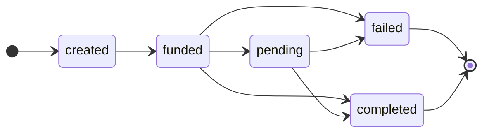

# Pouch Remit API

### Table of Contents
- [Authentication](#authentication)
- [Test Data](#test-data)
- [Errors](#errors)
- [Environments](#environments)
- [Payment Methods](#payment-methods)
- [Invoices](#invoices)
- [Webhooks](#webhooks)

## Authentication
Authentication is required to access any endpoint. You need the API Key in the `X-Pouch-Api-Key` header. An additional `X-Pouch-Signature` header with a signature generated using a HMAC with SHA256, a secret key and a request body is required for some endpoints.

Please contact **hello@pouch.ph** to get started.

## Test Data
|Name|Type|Account/Mobile Number|Status
|-|-|-|-|
|Nicole Clem|mobileMoney|09999999999|Successful|
|Wayne Watts|mobileMoney|09888888888|Failed|
|Peter Chandler|bank|15555555555|Successful|
|Theodora Benson|bank|17777777777|Failed|

## Errors
### HTTP Codes
|HTTP Status|Title|Description
|-|-|-|
|200|OK|The request was successful|
|201|Created|The resource was sucessfully created|
|400|BadRequest|A failed request validation occurred|
|401|Unauthorized|Invalid authentication|
|403|Forbidden|Invalid permission to perform the request|
|404|NotFound|The resource does not exist|
|422|Unprocessable|Unable to process the request|
|500|InternalServerError|An internal Pouch error has occured|

### Error Messages
|HTTP Status|Code|Message|Details|
|-|-|-|-|
400|BadRequest|Validation failed for schema (.*)|Contains validation details|
401|Unauthorized|API Key is required|
401|Unauthorized|API Key is invalid|
401|Unauthorized|Signature is required|
401|Unauthorized|Signature is invalid|
403|Unauthorized|Invalid Access|
404|NotFound|Invoice not found|
422|Unprocessable|Payment method is invalid|
422|Unprocessable|Transfer amount not in range|
500|InternalServerError|(.*)|
### Error Responses
Examples:
```js
// 400 Bad Request
{
  "error": {
    "code": "BadRequest",
    "message": "Validation failed for schema createInvoice",
    "details": [
      "description is a required field"
    ]
  }
}
```
```js
// 400 Bad Request
{
  "error": {
    "code": "BadRequest",
    "message": "Validation failed for schema createInvoice",
    "details": [
      "recipient.mobileNumber is invalid"
    ]
  }
}
```
```js
// 401 Unauthorized
{
  "error": {
    "code": "Unauthorized",
    "message": "Invalid Signature",
    "details": []
  }
}
```
```js
// 404 NotFound
{
  "error": {
    "code": "NotFound",
    "message": "Invoice not found",
    "details": []
  }
}
```
```js
// 422 Unprocessable
{
  "error": {
    "code": "Unprocessable",
    "message": "Payment Method is invalid",
    "details": []
  }
}
```
```js
// 500 InternalServerError
{
  "error": {
    "code": "NotFound",
    "message": "Failed fetching exchange rates",
    "details": []
  }
}
```
## Environments
|Environment|URL|
|-|-|
|Sandbox|https://pouch-remit-sandbox.herokuapp.com|
|Production|Please contact **hello@pouch.ph**|

## Payment Methods
### GET /v1/paymentMethods
- Fetches list of payment methods categorized by type (i.e. mobileMoney, bank)
- The properties in the `fields` per type are required to be passed in the `recipient` object when creating an invoice

Headers
```
X-Pouch-Api-Key: apiKey
Content-Type: application/json
```
Response
```js
{
  "data": {
    "results": {
      "mobileMoney": [
        {
          "code": "GXCHPHM2XXX",
          "name": "G-Xchange / GCash"
        },
        {
          "code": "PAPHPHM1XXX",
          "name": "PayMaya Philippines Inc"
        }
      ],
      "bank": [
        {
          "code": "APHIPHM2XXX",
          "name": "Alipay / Lazada Wallet"
        },
        {
          "code": "AUBKPHMMXXX",
          "name": "ASIA UNITED BANK"
        }
      ]
    },
    "fields": {
      "mobileMoney": [
        {
          "label": "Full Name",
          "type": "String",
          "key": "name"
        },
        {
          "label": "Mobile Number",
          "type": "String",
          "key": "mobileNumber"
        }
      ],
      "bank": [
        {
          "label": "Full Name",
          "type": "String",
          "key": "name"
        },
        {
          "label": "Account Number",
          "type": "String",
          "key": "accountNumber"
        }
      ]
    }
  }
}
```

## Invoices
A resource that you use to initiate a remittance to a target payment method. It's composed of states that you can use to track the progress from initalization until completion.


|Type|Description
|-|-|
|created|initial state, waiting for invoice to be settled
|funded|invoice settled and acknowledged
|pending|waiting for fulfillment
|failed|failed transfer
|completed|successful transfer


### POST /v1/invoices
- Creates an invoice that expires within `120` seconds
- Guarantees the exchange rate upon creating an invoice
- The `description` field will be used as `memo` in the invoice
- There's a min/max limit of `PHP1.00`/`PHP50,000.00` per transaction (computed from SAT -> PHP)


Headers
```
X-Pouch-Api-Key: apiKey
X-Pouch-Signature: 0888bb3c0b398422bcda0f612857f7da7fa5c70ca390c0b20c7853214dc06866
Content-Type: application/json
```
Request
```js
// POST /v1/invoices
{
  "referenceId": "4a9d7d95-4fdf-4ad7-a7f2-ae2ea1e426bd",
  "description": "test description",
  "paymentMethodCode": "MYDBPHM2XXX",
  "currency": "SAT",
  "amount": 10000,
  "recipient": {
    "name": "Netbank (A Rural Bank), Inc.",
    "accountNumber": "199000000040"
  }
}
```

|Property|Type|Format|Min-Max|Required
|-|-|-|-|-|
|`referenceId`|`string`|`uuid4`|`32 char`|`Y`
|`description`|`string`|`any`|`1-64 char`|`Y`
|`paymentMethodCode`|`string`|`any`|`1-64 char`|`Y`
|`currency`|`string`|`SAT`|`-`|`Y`
|`amount`|`integer`|`integer`|`-`|`Y`
|`recipient..name`|`string`|`any`|`1-64 char`|`Y`
|`recipient..accountNumber`|`string`|`integer`|`1-64 char`|`Conditional`
|`recipient..mobileNumber`|`string`|`msisdn`|`-`|`Conditional`

- A paymentMethodCode that belongs to a mobileMoney type is required to provide `recipient..mobileNumber`. For bank type, `recipient..accountNumber` is required.

To compute for the signature:
```js
// nodejs
const crypto = require('crypto')

const sign = (body, secret) => {
  const hmac = crypto.createHmac('sha256', secret)
  return hmac.update(JSON.stringify(body)).digest('hex')
}
// hash: 888bb3c0b398422bcda0f612857f7da7fa5c70ca390c0b20c7853214dc06866
```

Response
```js
// 201 Created 
// or 200 OK (when referenceId is used we'll return the existing invoice)
{
  "data": {
    "referenceId": "4a9d7d95-4fdf-4ad7-a7f2-ae2ea1e426bd",
    "status": "created",
    "bolt11": "lntb11230p1p36kgvvpp5uzadrnezra4kjxwer3sxw5hzhqgp7zgdthpk08jsggvpha6u9yjqdqhw35xjueqd9ejqcfqw3jhxaqcqzpgxqzpusp5y0cj6e50my58ywzdpq7qj4gz7gpdnw0g3r4lhy3f6xc0fn7pqv7q9qyyssqnvenuq6mcve084dxms7u92ta5zn9u4qvsgawv7fcqcavx7eqqvlkmt7fzrk44y9hh29zz5knlama48sy2vrzl23aj9lg3gx2xckesqsqkwwju7",
    "senderDetails": {
      "amount": 10000,
      "currency": "SAT"
    },
    "recipientDetails": {
      "name": "Netbank (A Rural Bank), Inc.",
      "accountNumber": "199000000040",
      "amount": 92,
      "currency": "PHP"
    },
    "rates": {
      "btc": {
        "value": 1,
        "php": 920098.0894,
        "usd": 16409.2728
      },
      "php": {
        "value": 1,
        "sat": 108.684,
        "usd": 0.0178
      },
      "usd": {
        "value": 1,
        "sat": 6094.1152,
        "php": 56.0718
      },
      "sat": {
        "value": 1,
        "php": 0.0092,
        "usd": 0.0001
      }
    },
    "fees": {
      "partnerFee": {
        "amount": 30,
        "currency": "PHP"
      }
    },
    "createdAt": "2022-12-27T16:47:08.243Z",
    "updatedAt": "2022-12-27T16:50:26.353Z"
  }
}
```

### GET /v1/invoices/:referenceId
- Retrieves an invoice by reference id

Headers
```
X-Pouch-Api-Key: apiKey
```
Request
```js
GET /v1/invoices/4a9d7d95-4fdf-4ad7-a7f2-ae2ea1e426bd
```

|Property|Type|Format|Min-Max|Required
|-|-|-|-|-|
|`referenceId`|`string`|`uuid`|`32 char`|`Y`

Response
```js
// 200 OK
{
  "data": {
    "referenceId": "4a9d7d95-4fdf-4ad7-a7f2-ae2ea1e426bd",
    "status": "created",
    "bolt11": "lntb11230p1p36kgvvpp5uzadrnezra4kjxwer3sxw5hzhqgp7zgdthpk08jsggvpha6u9yjqdqhw35xjueqd9ejqcfqw3jhxaqcqzpgxqzpusp5y0cj6e50my58ywzdpq7qj4gz7gpdnw0g3r4lhy3f6xc0fn7pqv7q9qyyssqnvenuq6mcve084dxms7u92ta5zn9u4qvsgawv7fcqcavx7eqqvlkmt7fzrk44y9hh29zz5knlama48sy2vrzl23aj9lg3gx2xckesqsqkwwju7",
    "senderDetails": {
      "amount": 10000,
      "currency": "SAT"
    },
    "recipientDetails": {
      "name": "Netbank (A Rural Bank), Inc.",
      "accountNumber": "199000000040",
      "amount": 92,
      "currency": "PHP"
    },
    "rates": {
      "btc": {
        "value": 1,
        "php": 920098.0894,
        "usd": 16409.2728
      },
      "php": {
        "value": 1,
        "sat": 108.684,
        "usd": 0.0178
      },
      "usd": {
        "value": 1,
        "sat": 6094.1152,
        "php": 56.0718
      },
      "sat": {
        "value": 1,
        "php": 0.0092,
        "usd": 0.0001
      }
    },
    "fees": {
      "partnerFee": {
        "amount": 30,
        "currency": "PHP"
      }
    },
    "createdAt": "2022-12-27T16:47:08.243Z",
    "updatedAt": "2022-12-27T16:50:26.353Z"
  }
}
```

## Webhooks
A resource used to get you notified on certain state changes of an invoice via an HTTP call to your preconfigured url.

Pouch will generate a signature using HMAC with SHA256 and assign it to the `X-Pouch-Signature` header per webhook event. A POST request will be sent and will be expecting a 2xx response from the client.

### Events
|Type|Description
|-|-|
|`invoice.paid`|triggers when the invoice status transitions to `completed`|
|`invoice.failed`|triggers when the invoice status transitions to `failed`|

To verify the signature:
1. You need to extract the `X-Pouch-Signature` in the header upon receiving the request
2. Concatenate the request body and compute the HMAC with SHA256 using the secret key
3. Compare the generated hash against the value in `X-Pouch-Signature`

```js
// nodejs
const crypto = require('crypto')

const verify = (headers, body, secret) => {
  const signature = headers['X-Pouch-Signature']

  const hmac = crypto.createHmac('sha256', secret)
  const hash = hmac.update(JSON.stringify(body)).digest('hex')
  
  return hash === signature
}
// true
```

### Event Payload

Headers
```
X-Pouch-Signature: 0888bb3c0b398422bcda0f612857f7da7fa5c70ca390c0b20c7853214dc06866
Content-Type: application/json
```
Request
```js
{
  "event": "invoice.paid",
  "payload": {
    "referenceId": "4a9d7d95-4fdf-4ad7-a7f2-ae2ea1e426bd",
    "status": "completed",
    "bolt11": "lntb11230p1p36kgvvpp5uzadrnezra4kjxwer3sxw5hzhqgp7zgdthpk08jsggvpha6u9yjqdqhw35xjueqd9ejqcfqw3jhxaqcqzpgxqzpusp5y0cj6e50my58ywzdpq7qj4gz7gpdnw0g3r4lhy3f6xc0fn7pqv7q9qyyssqnvenuq6mcve084dxms7u92ta5zn9u4qvsgawv7fcqcavx7eqqvlkmt7fzrk44y9hh29zz5knlama48sy2vrzl23aj9lg3gx2xckesqsqkwwju7",
    "senderDetails": {
      "amount": 10000,
      "currency": "SAT"
    },
    "recipientDetails": {
      "name": "Netbank (A Rural Bank), Inc.",
      "accountNumber": "199000000040",
      "amount": 92,
      "currency": "PHP"
    },
    "rates": {
      "btc": {
        "value": 1,
        "php": 920098.0894,
        "usd": 16409.2728
      },
      "php": {
        "value": 1,
        "sat": 108.684,
        "usd": 0.0178
      },
      "usd": {
        "value": 1,
        "sat": 6094.1152,
        "php": 56.0718
      },
      "sat": {
        "value": 1,
        "php": 0.0092,
        "usd": 0.0001
      }
    },
    "fees": {
      "partnerFee": {
        "amount": 30,
        "currency": "PHP"
      }
    },
    "createdAt": "2022-12-27T16:47:08.243Z",
    "updatedAt": "2022-12-27T16:50:26.353Z"
  }
}
```

### Retry Strategy
If we received a non-2xx response, we'll re-schedule the webhook delivery using an exponential backoff retry policy with a power of 2, with 30 mins (1800 secs) delay, up to 5 times attempt.


### PUT /v1/webhooks
- Creates or updates existing webhook

Headers
```
X-Pouch-Api-Key: apiKey
X-Pouch-Signature: 6d87c3d2360e8f6fafe7379ce21706eb9200009f646851d4eaa3202dd3d3be30
Content-Type: application/json
```

Request
```js
// PUT /v1/webhooks
{
  "event": "invoice.paid",
  "url": "https://sample.com"
}
```

|Property|Type|Format|Min-Max|Required
|-|-|-|-|-|
|`event`|`String`|`invoice.paid` `invoice.failed`|`-`|`Y`
|`url`|`String`|`url`|`1-64 char`|`Y`

To compute for the signature:
```js
// nodejs
const crypto = require('crypto')

const sign = (body, secret) => {
  const hmac = crypto.createHmac('sha256', secret)
  return hmac.update(JSON.stringify(body)).digest('hex')
}
// hash: 6d87c3d2360e8f6fafe7379ce21706eb9200009f646851d4eaa3202dd3d3be30
```

Response
```js
// 204 NO CONTENT
```

### GET /v1/webhooks
- Lists webhooks

Headers

```java
X-Pouch-Api-Key: apiKey
```
Request
```js
GET /v1/webhooks
```

Response
```js
// 200 OK
{
  "data": [
    {
      "event": "invoice.paid",
      "url": "https://sample.com",
      "createdAt": "2022-12-27T16:41:13.433Z",
      "updatedAt": "2022-12-27T16:43:26.777Z"
    },
    {
      "event": "invoice.failed",
      "url": "https://sample.com",
      "createdAt": "2022-12-27T16:41:13.433Z",
      "updatedAt": "2022-12-27T16:43:26.777Z"
    }
  ]
}
```
